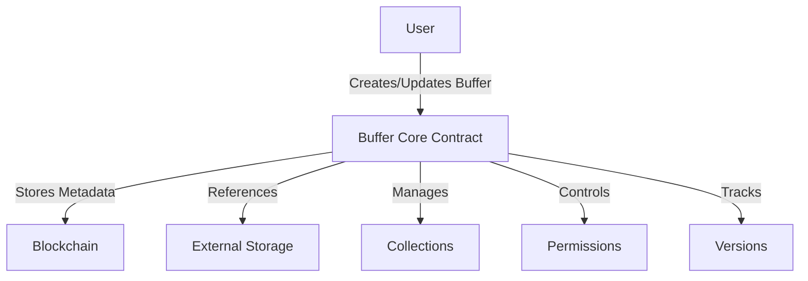

# Buffer Rollup

A decentralized buffer management and versioning system built on the Stacks blockchain for secure, transparent, and controlled data storage.

## Overview

Buffer Rollup provides a blockchain-based solution for managing buffer references with immutable tracking, version control, and granular access management. The system stores buffer metadata and access rights on-chain, enabling secure and auditable data interactions.

### Key Features
- Create and manage buffer collections
- Store buffer metadata with comprehensive version tracking
- Implement granular access permissions
- Track buffer ownership and mutation history
- Cryptographically secure buffer references
- Flexible permission management

### Use Cases
- Decentralized data archival systems
- Collaborative research and development
- Secure multi-party data sharing
- Audit-trail maintenance for critical data
- Versioned configuration management

## Architecture

The system is built around a core smart contract that manages buffer metadata, collections, and permissions:



### Core Components
- Buffer Registry
- Collection Management
- Granular Permission System
- Comprehensive Version Control
- Immutable Access Tracking

## Contract Documentation

### buffer-core.clar

The primary contract managing buffer metadata, versioning, and access controls.

#### Permission Levels
- NONE (0): No access
- VIEW (1): Read-only access
- EDIT (2): Modification permissions
- ADMIN (3): Full administrative control

#### Key Data Structures
- `collections`: Collection metadata storage
- `buffers`: Buffer reference and metadata tracking
- `collection-buffers`: Buffer-to-collection mapping
- `buffer-versions`: Detailed version history
- `collection-permissions`: Collection-level access rights
- `buffer-permissions`: Buffer-specific access controls

## Getting Started

### Prerequisites
- Clarinet
- Stacks wallet
- IPFS or Gaia storage setup

### Installation
1. Clone the repository
2. Install dependencies
3. Deploy using Clarinet

```bash
clarinet deploy
```

### Basic Usage

1. Create a buffer collection:
```clarity
(contract-call? .buffer-core create-collection 
    "collection-123" 
    "Research Data" 
    (some "Scientific experiment buffers"))
```

2. Add a buffer reference:
```clarity
(contract-call? .buffer-core add-buffer
    "buffer-456"
    "Experiment Results"
    (some "Quantum computing research data")
    "json"
    "https://storage.example.com/data"
    0x1234...
    u2048)
```

## Function Reference

### Collection Management
- `create-collection`: Initialize a new buffer collection
- `delete-collection`: Remove an existing collection
- `get-collection`: Retrieve collection metadata

### Buffer Management
- `add-buffer`: Register a new buffer reference
- `update-buffer`: Create a new buffer version
- `delete-buffer`: Remove a buffer from the system
- `get-buffer`: Retrieve buffer details
- `get-buffer-version`: Access specific version information

### Permission Management
- `grant-buffer-permission`: Set buffer access rights
- `grant-collection-permission`: Configure collection access
- `can-view-buffer`: Validate view permissions
- `can-edit-buffer`: Validate edit capabilities
- `can-admin-collection`: Check administrative access

## Development

### Testing
Run the test suite using Clarinet:
```bash
clarinet test
```

### Local Development
1. Start Clarinet console:
```bash
clarinet console
```

2. Deploy contracts:
```clarity
(contract-call? .docunest-core ...)
```

## Security Considerations

### Key Security Features
- Immutable audit trail of all document changes
- Granular permission controls
- Owner-only administrative actions
- Version history tracking

### Best Practices
1. Always verify document hashes after upload
2. Use appropriate permission levels
3. Regularly audit access permissions
4. Keep private keys secure
5. Backup documents in secure locations

### Limitations
- Document content stored off-chain
- Gas costs for frequent updates
- Block size limits for batch operations
- Permission inheritance not implemented